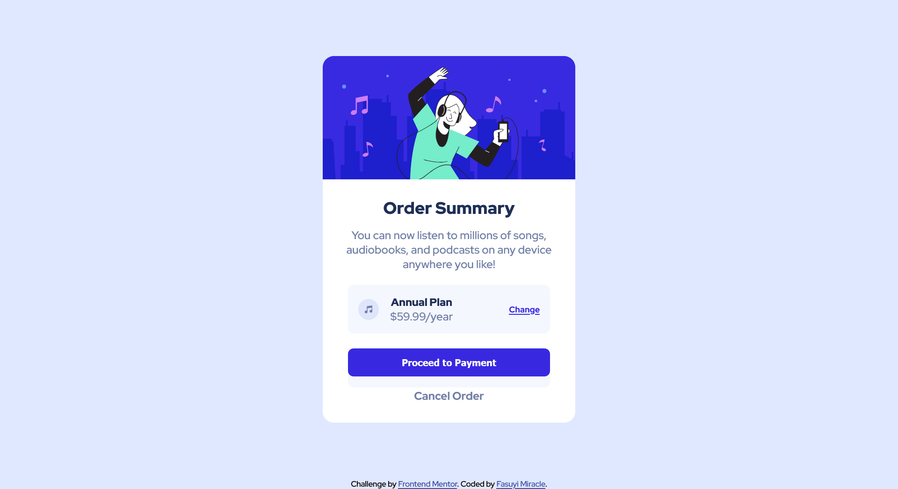

# Frontend Mentor - Order summary card solution

This is a solution to the [Order summary card challenge on Frontend Mentor](https://www.frontendmentor.io/challenges/order-summary-component-QlPmajDUj). Frontend Mentor challenges help you improve your coding skills by building realistic projects. 

## Table of contents

- [Overview](#overview)
  - [The challenge](#the-challenge)
  - [Screenshot](#screenshot)
  - [Links](#links)
  - [Built with](#built-with)
  - [My process](#my-process)
  - [What I learned](#what-i-learned)
  - [Author](#author)
  - [Acknowledgments](#acknowledgments)
 

## Overview

### The challenge

Users should be able to:

- See hover states for all interactive elements on the page

### Screenshot

### Links

- Solution URL: (https://github.com/iammiracle01/order-summary)
- Live Site URL: (https://iammiracle01.github.io/Responsive-Huddle-Landing-Page/)

## My process
1. First of all, I started out with the normal HTMl semantic structure(head, body.....footer).
2. Furthermore, I created my card component and added the images alongside the subsequent text.
3. Thirdly I moved into my stylesheet and designed what my page should look like using flexbox and some other css custom properties.
4. Finally, launched the final outcome on Github Pages.

### Built with

- Semantic HTML5 markup
- CSS custom properties
- Flexbox

### What I learned
1. I discovered how to effectly use the css combinators, pseudo-classes and pseudo-elements.
2. Got some new flexbox tricks.

### Useful resources

- (https://www.freecodecamp.org) - This helped me understand the effective usage of flexbox.
- (https://www.w3schools.com) - This is an amazing website which helped me finally understand responsive media queries. I'd recommend it to anyone still learning this concept.

## Author

- Website - [Fasuyi Miracle Boluwatife](https://github.com/iammiracle01)
- Frontend Mentor - [@iammiracle01](https://www.frontendmentor.io/profile/iammiracle01)
- Twitter - [@iammiracle_01](https://www.twitter.com/iammiracle_01)

## Acknowledgments
  I acknowledge the help of the following websites I wrote in the useful resources section. Furthermore, as an upcoming developer, using google to find out is a very much needed skill as this helped me out a lot.
